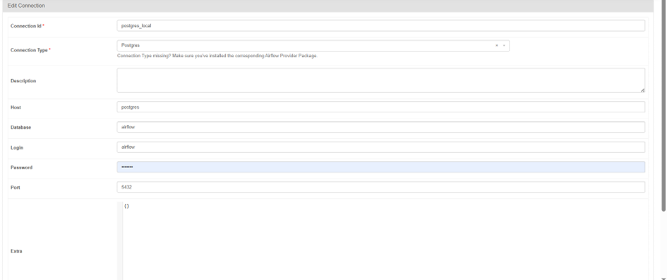
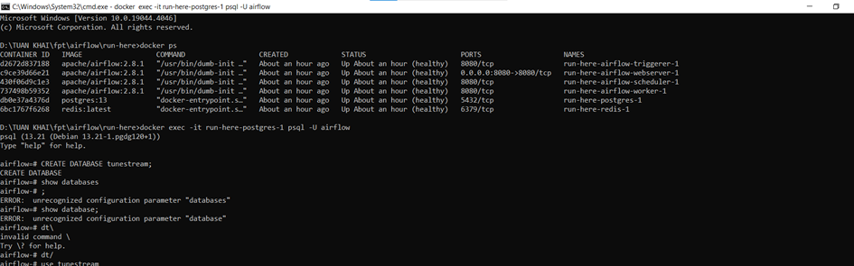
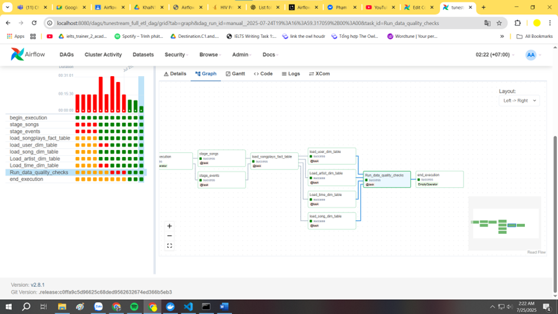

I set up a folder called run-here to use docker-compose.
The python DAG file is at run-here/dags/step12345.py.
Below is the connection set up.

I connected to the psql through terminal to check

The task is done

**_NOTE_**: The module psycopg2 is installed through docker.

The final run-id and its log can be found at 
